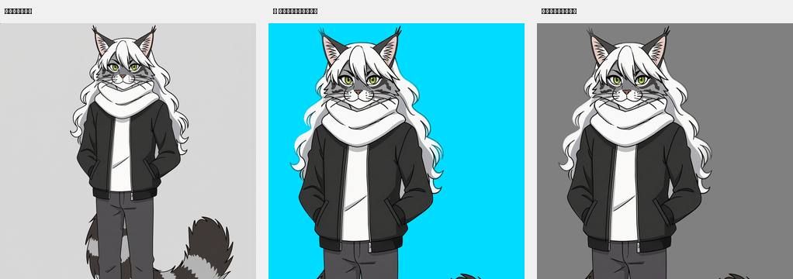

# 纯色背景专用超级抠图工具

### Super Keyer for Solid-Color Backgrounds


**一句话：专门抠纯色背景上的角色素材，发丝缝里的背景也能给你扣干净。**

<p align="center">
  
</p>

---

## 先说这玩意儿怎么来的

我为了一张立绘的边缘，折腾了整整一天。

一开始我挺自信。纯色背景嘛，量一下背景色，算个颜色距离，阈值一卡，完事。结果出来一看，头发缝隙里全是没扣掉的背景，下巴两边也是一块一块的。我以为是阈值没调好，调了三轮，越调越糟。调松了角色内部被吃掉，调紧了缝隙又漏出来，就在这两个坏结果之间来回摆。

后来我把市面上那几个开源抠图模型全下下来跑了一遍。isnet-anime、BiRefNet、RMBG，一个个试。**然后我发现了真正的问题。**

**五张结果里，那道色边全都在。**

不是我抠得不好。是**源图里本来就有**。生成模型在渲染的时候，角色边缘的抗锯齿像素就已经跟背景色混在一起了，那是一层「半背景」的像素。任何抠图算法都拿不掉它，因为那个颜色真的存在于像素里。

那天我学到了两件事，都比代码值钱，都写在 [docs/PITFALLS.md](docs/PITFALLS.md) 里了。

**第一件：色板的距离不能担保像素的安全。**

我算过角色主色离背景最近有 59，心想容差给 30 总万无一失了吧。结果挖出一堆洞。原因很简单，那个 59 是**颜色的代表值**之间的距离，可实际像素会被抗锯齿、阴影、混合一路拉近背景。**能担保像素安全的，只有在像素上量一遍，没有别的办法。** 所以这个工具里内置了一个一秒的洞数检测，加任何后处理之前先跑它。

**第二件：验证用的底色选错了，等于没验。**

我拿着中灰底"验证"了一版，觉得挺好，交出去了。然后被打回来，一眼就看出漏。因为残留的背景本身就是灰的，合成到灰底上，跟透明区长得一模一样。**我根本看不出问题。** 换成青色底，透明显青，残留显灰，一眼就现形。

---

## 那它凭什么能抠干净

通用工具手上只有一把刀。这个工具同时用了两把，而且让它们互相补。

| | 靠什么判断 | 强项 | 短板 |
|---|---|---|---|
| **传统 matting**（pymatting）| 颜色阈值 | ⭐ 那些"颜色≈背景"的**小空隙**判得准 | 不懂语义 |
| **isnet-anime**（rembg）| 语义分割 | ⭐ **主体轮廓**准 | **会漏小洞** |

关键就在这两把刀的短板**几乎不重叠**。模型漏掉的小洞，正好是颜色阈值最擅长的地方。颜色阈值语义上犯的错，模型能兜住。

**所以取交集。前景 = A ∩ B，翻译成人话就是：任何一方说是背景，就扣掉。**

我一开始把交集取反了，做成"双方都说是背景才扣"，就是保守版本。被纠正过来之后才发现，这个方向才对。要的就是**能扣多干净扣多干净**。

---

## 数字，自己看

同一张 1024×1536 的动漫角色素材，量「边缘被背景色污染」的像素：

| 方案 | 污染像素 |
|---|---|
| 传统 matting 单干 | 7724 |
| 语义模型单干，没开 alpha_matting | 7724 |
| 语义模型 + alpha_matting | 443 |
| ⭐ **本工具，混合取交集** | **0** |

**7724 到 0。而且我是拿青色底放大一格一格看过的，发丝、下巴两侧、辫子和肩膀之间，都干净，角色没被削。**

---

## 另一条路：顺着勾线切（`line_keying.py`）

上面那套是"用两种方法在同一张图上取交集"。后来我又被点醒一次，这次是结构上的一条捷径：

> **「人物本身是有勾线的，顺着勾线切割其实会很干净的。」**

我之前的阈值，边界落在**抗锯齿那条模糊带**里——在那儿切哪一刀都不对：切多了吃角色，切少了留一圈背景混色，那圈暗边就是从这来的。而勾线是一条深色、高对比、位置唯一的线，**它本来就是画上去的切割线。**

所以第二条路很直接：从画面四边泛洪，**勾线天然阻断泛洪**，灌不进去的就是角色。角色内部的封闭空腔（手叉腰的三角、辫子跟肩之间的缝）再单独泛洪一次，种子取"块内最像背景的那个像素"。

实测参数很不敏感：`TOL_OUT` 从 20 加到 65，切出的角色像素只差 3.5%。因为拦住泛洪的是勾线，不是阈值。

| | 顺着勾线切 | 交集法 |
|---|---|---|
| 硬边（人物、道具、描边插画）| ⭐ 干净，参数不敏感 | 边界落在模糊带里 → 留暗边 |
| 发丝级细结构 | ⚠️ 没有勾线的地方无从下手 | ⭐ 主场 |
| 速度 / 依赖 | 0.2s/帧，不用模型 | 秒级，需要模型 |

两个的短板不重叠，可以串着用：**有勾线的地方用勾线切，没有勾线的细结构交回 matting。**

⛔ 它唯一的失败模式是**勾线断口**——线断了泛洪就钻进去。这个还在收。详见 [docs/LINE_KEYING.md](docs/LINE_KEYING.md)。

---

## 装和用

```bash
pip install -r requirements.txt
```

第一次跑会自动下模型（默认 isnet-anime，168MB 左右，实测效果最好那个）。

```bash
# 单张
python pure_bg_keying.py 输入.png 输出.png

# 一整段序列帧，自动做时域平滑防闪
python pure_bg_keying.py ./frames/ ./keyed/ --temporal 3

# 换模型，或者不要裁边
python pure_bg_keying.py in.png out.png --model birefnet-general --no-crop

# ⭐ 另一条路：顺着勾线切（不用模型，参数不敏感）
python line_keying.py in.png out.png
python line_keying.py ./frames/ ./keyed/ --tol-out 30
```

跑起来会自己报数：

```
[单图] input.png  1024x1536
    背景 [99 99 99]   A 251896px  B 254277px  → 交集 254808px
    洞 28 个（≥8px 5 个，合计 2768px）   4.4s
```

**1200 万像素的图，四秒多。CPU 就够。**

---

## 我得说清楚它做不到什么

**发梢最末端那一圈淡灰，去不掉。**

那些像素的颜色是 `α·角色 + (1−α)·背景`，它既不是背景也不是角色。任何阈值方法都只能在两个坏结果里选一个：判成背景，发丝就被削细，更难看，判成角色，就留一圈淡灰。我选了后者。

这是物理下限，不是我参数没调好。我换过三四种完全不同的思路，全都没改善，才确认到这儿到底了。

**怎么判断你自己遇到的是不是也到底了**：换两三种思路都没起色，那就是到底了，别继续调参。该往源头走，出图的时候让发梢更"硬"一点，混合像素自然就少。或者上人工，图层蒙版修关键帧。

还有一件事得提醒：**这工具是给纯色背景做的。** 复杂场景、渐变背景、多个主体，用通用抠图服务去，别用这个。

---

## 一个反直觉的坑

**别为了抠图特意去出洋红底或者绿幕底。**

我试过。分割确实更轻松了，因为背景离角色远。但代价是**边缘被染成肉眼可见的粉边**。背景越饱和，那个混合边越显眼。

中性灰反而更好。分割是稍微难一点，但污染出来是淡灰，读起来像阴影，根本看不出来。

**背景色是个取舍，不是越远越好。** 这个取舍在用了混合算法之后基本被抹平了，所以老老实实用中性灰就行。

---

## 仓库里还有什么

```
pure_bg_keying.py     主程序，单文件，246 行（交集法）
line_keying.py        顺着勾线切，单文件（不用模型，参数不敏感）
docs/
  TECHNIQUE.md        为什么取交集，每个参数是哪来的，背景色怎么选
  PITFALLS.md         我试过并且失败的七件事，别再试了
  LINE_KEYING.md      顺着勾线切：为什么边界本来就在那儿，以及它现在还做不到什么
  VALIDATION.md       怎么验证抠得干不干净
examples/             示例和对照图
```

[docs/PITFALLS.md](docs/PITFALLS.md) 那份清单里七条，全是实测出来的反效果。颜色清理、精确去污染、混合方程反解、分块放大、不开 alpha_matting、还有那个"出两版颜色"的方案。**第六条值得单独说一句：视频里每一帧姿态都不一样，两版之间根本没有稳定对应关系，所以抠图必须在单一版本上解决。** 这也正是这个工具选择"两种方法在同一张图上取交集"的原因。**第七条是另一回事——它讲的是"指标变好不等于观感变好"，我今天刚栽了两次。**

---

## 许可

MIT。商用随便用。

## 站在谁肩上

[rembg](https://github.com/danielgatis/rembg) · [pymatting](https://github.com/pymatting/pymatting) · [U²-Net / ISNet](https://github.com/xuebinqin/U-2-Net)

---

**如果你也在这个坑里，希望你不用像我一样耗一整天。**
